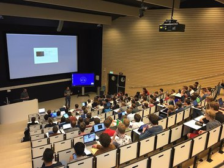

# The Software Engineering Research Group
 

The mission of the TU Delft Software Engineering Research Group (SERG) is

1.  to develop a deep understanding of how people build and evolve software systems;
    
2.  to develop novel methods, techniques, theories, and tools that advance the way in which software is built and adjusted;
    
3.  to ensure that our research results have a lasting impact in software development practice; and
    
4.  to offer students an education that prepares them to take a leading role in complex software development projects.
    

Research
--------

The research of the TU Delft Software Engineering Research Group is characterized by a focus on empirical research, conducted in close collaboration with software development practice. Topics of interest include software testing, software architecture, end user programming, software evolution, and collaborative and distributed software development.

To accomplish our research goals, our research is organized across the following research lines:

* [Computational Intelligence for Software Engineering (CISELab)](/research-lines/ci4se/): How can Computational Intelligence techniques automate software testing and other complex software development tasks?
* [DevOps](/research-lines/devops/): To understand and improve the modern CI/CD and DevOps practices.
* [Machine Learning for Software Engineering](/research-lines/ml4se/): How can machine learning be used to improve complex software development tasks?
* [Software Reliability for Concurrent and Distributed Systems](/research-lines/se-for-concurrency/): Develop methods and tools for increasing reliability of concurrent and distributed systems.
* [Software Engineering for Fintech](/research-lines/se-for-fintech/): Develop methods, tools, and technologies to radically innovate the software-intensive financial sector.
* [Software Engineering for Artificial Intelligence (SE4AI)](/research-lines/se4ai/): SE4AI is an emerging field of research that tries to understand how software systems with AI components can be developed, tested, deployed, scaled and maintained in a continuous, sustainable and efficient manner.
* [Software Analytics](/research-lines/software-analytics/): How can we harness the massive data modern development and deployment processes generate, as well as Big Code, to increase development productivity and operational efficiency?
* [Software Quality](/research-lines/software-quality/): Help developers in improving the internal and external quality of their software systems.
* [Sustainable Software Engineering](/research-lines/sustainable-se/): Methods and tools to develop greener and socially sustainable software systems.

We conduct our research in mixed teams, in collaboration with practitioners and international researchers. We publish our research in the top venues in the field. Members of SERG actively serve in organizational and program committees of these conferences and editorial boards of these journals.

We are strong supporters of open science, and self-archive our publications in the [TU Delft institutional repository](https://pure.tudelft.nl/portal/en/organisations/software-engineering(d40bac4b-3dd0-4427-aa5f-9331cae5d02e)/publications.html) and through our Technical Reports series. We aim at sharing our research prototypes as open source tools whenever possible.

Education
---------

We have a passion for teaching and a deep desire to share what we learn about software engineering with our students. Our [teaching activities](../teaching) include:

* Undergraduate courses in the TU Delft bachelor in computer science, covering such topics as object-oriented programming, various projects, software testing, big data processing, and software engineering.
    
* Advanced software engineering courses in the TU Delft master programs in computer science and embedded systems, covering such topics as software architecture, search-based software engineering, psychology of programming, and software analytics.
    
* Nine-month projects with our MSc students who advance our knowledge in software engineering by participating in our research projects – often in collaboration with our industrial partners.
    
* Introductory courses in the TU Delft minor and digital skills programs, offering non-CS students a background in programming, data science, and software engineering;
    
* On line courses offered through the TU Delft EdX platform, on such topics as data analysis and Scratch programming, which have attracted tens of thousands of students from across the globe.
    
